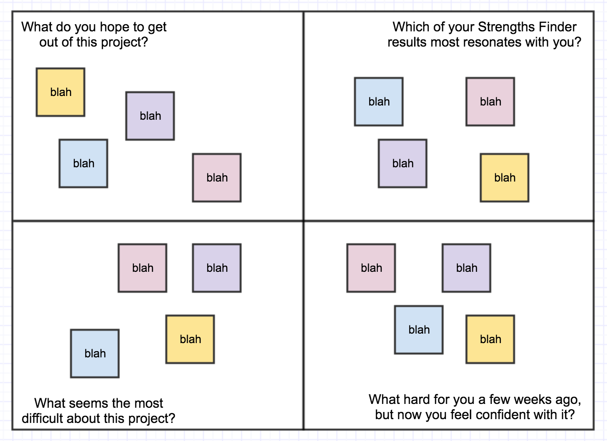

# Group setup

First, let's take a look at starting the project off with your group members in an effective manner:

# Bonus Calculator App

You are going to write a single JavaScript file to automatically calculate employee bonus for a company.

## Data Structure

The company is providing you with a few sample objects that serve as examples of how their data is currently being stored. Each object contains employee information. Each of these objects are stored in a main array named `employees`.

### Employee Array
Each **employee object** currently is configured in this way:

* The `name` property holds the employees name.
* The `employeeNumber` property has their employee number.
* The `annualSalary` property contains their base annual salary.
* The `reviewRating` property contains their review rating.

## Logic
You will be taking these object literals and turning them into **Employee**'s. Write a function that takes in one **employee** (as an argument to the function), and returns a new **Employee**:

* The `name` property should contain the employee's name.
* The `bonusPercentage` property should contain the bonus percentage the employee is to receive. See section below for calculation instructions.
* The `totalCompensation` property should be the adjusted annual compensation (base annual + bonus)
* The `totalBonus` should be the employee's total bonus rounded to the nearest dollar.

> NOTE: You will need to create an **Employee** class.

Finally, iterate over the `employees` array and

* use each `employee` object as the input to your first function
* `console.log` the results of each iteration.

### Individual Bonus calculation
- Those who have a rating of a 2 or below should not receive a bonus.
- Those who have a rating of a 3 should receive a base bonus of 4% of their base annual income.
- Those who have a rating of a 4 should receive a base bonus of 6% of their base annual income.
- Those who have a rating of a 5 should receive a base bonus of 10% of their base annual income.
- If their employee number is 4 digits long, this means they have been with the company for longer than 15 years,
and should receive an additional 5%.
- However, if their annual income is greater than $65,000, they should have their bonus adjusted down 1%.
- No bonus can be above 13% or below 0% total.

NOTE: You may abstract out this bonus calculation into a second function if you like, but this is not mandatory.

## Hard Mode
Put the output on the DOM (visually on the page).

## Pro Mode
Make the app run only after the user clicks on a button on the page. Then style the output, make it visually appealing.
